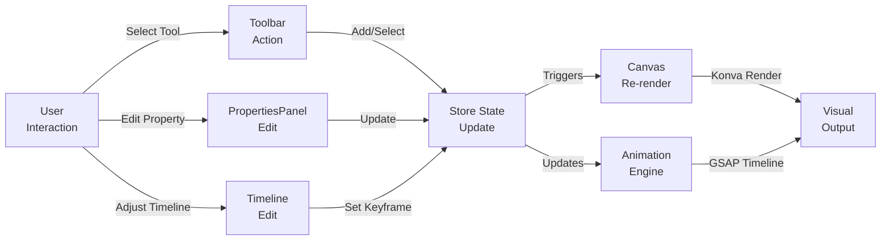
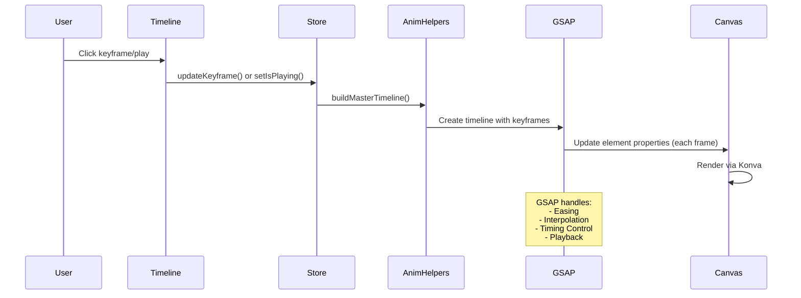

# Banner Tool - Architecture Diagram

## System Architecture

```mermaid
graph TB
    subgraph Entry["Entry Point"]
        Main["main.tsx"]
        App["App.tsx"]
        ModeSelect["ModeSelect<br/>(EMR vs Animated)"]
    end

    subgraph StateManagement["State Management"]
        Store["designStore.ts<br/>(Zustand)"]
        HistoryState["History State<br/>(Undo/Redo)"]
    end

    subgraph MainLayout["MainLayout - Central Orchestrator"]
        Layout["MainLayout.tsx"]
        Toolbar["Toolbar.tsx<br/>(Tool Selection)"]
        Canvas["DesignCanvas.tsx<br/>(Konva Canvas)"]
        Props["PropertiesPanel.tsx"]
        Timeline["Timeline.tsx"]
        Layers["LayersPanel.tsx"]
        Assets["AssetsPanel.tsx"]
        Templates["TemplatesPanel.tsx"]
        Variations["VariationsPanel.tsx"]
    end

    subgraph CanvasSystem["Canvas Rendering System"]
        ElementShape["ElementShape.tsx<br/>(Konva Components)"]
        ISIScroll["ISIScroll.tsx<br/>(Scrollable ISI)"]
        ISIOverlay["ISIOverlay.tsx<br/>(ISI Header)"]
        KonvaElements["Konva Primitives<br/>(Stage, Layer, Rect,<br/>Circle, Text, Image,<br/>Path, Transformer)"]
        AnimHelpers["AnimationHelpers.ts<br/>(GSAP Integration)"]
    end

    subgraph AnimationSystem["Animation & Effects System"]
        Keyframes["keyframes.ts<br/>(Keyframe Model)"]
        Animations["animations.ts<br/>(Presets & Helpers)"]
        AnimistaLib["Animista Catalog<br/>(300+ Animations)"]
        GSAP["GSAP Library<br/>(Timeline Control)"]
    end

    subgraph DataModels["Data Models"]
        DesignElement["DesignElement<br/>(Text, Rect, Circle,<br/>Image, Video, Shape,<br/>ISI Scroll, HTML)"]
        Artboard["Artboard<br/>(Multiple Sizes)"]
        AnimationKeyframe["AnimationKeyframe<br/>(Position, Opacity,<br/>Rotation, Scale, etc.)"]
        ElementAnimation["ElementAnimation<br/>(Keyframe Timeline)"]
        ElementTimedAnimation["ElementTimedAnimation<br/>(Preset Blocks)"]
    end

    subgraph TemplateSystem["Template System"]
        Templates_ts["emrTemplates.ts"]
        BannerTemplate["BannerTemplate<br/>(EMR + Animated)"]
        EMRISIText["EMR ISI Text<br/>(Pre-loaded Content)"]
    end

    subgraph UtilityLayer["Utility Layer"]
        ImageHook["use-image hook<br/>(Image Loading)"]
        JSZIP["jszip<br/>(Export/Package)"]
        Lucide["lucide-react<br/>(Icons)"]
        Tailwind["Tailwind CSS<br/>(Styling)"]
        Clsx["clsx<br/>(Class Utils)"]
    end

    subgraph BuildTools["Build & Dev Tools"]
        Vite["Vite<br/>(Build & Dev Server)"]
        TypeScript["TypeScript<br/>(Type Safety)"]
        Vitest["Vitest<br/>(Testing)"]
        ESLint["ESLint<br/>(Linting)"]
    end

    %% Entry flow
    Main --> App
    App --> ModeSelect
    ModeSelect --> Layout

    %% Layout connections
    Layout --> Toolbar
    Layout --> Canvas
    Layout --> Props
    Layout --> Timeline
    Layout --> Layers
    Layout --> Assets
    Layout --> Templates
    Layout --> Variations

    %% State management
    Layout --> Store
    Toolbar --> Store
    Canvas --> Store
    Props --> Store
    Timeline --> Store
    Layers --> Store
    Assets --> Store
    Templates --> Store
    Variations --> Store
    Store --> HistoryState

    %% Canvas system
    Canvas --> ElementShape
    Canvas --> ISIScroll
    Canvas --> ISIOverlay
    ElementShape --> KonvaElements
    ISIScroll --> KonvaElements
    ISIOverlay --> KonvaElements

    %% Animation system
    Canvas --> AnimHelpers
    AnimHelpers --> GSAP
    Timeline --> Keyframes
    Props --> Keyframes
    Keyframes --> Animations
    Animations --> AnimistaLib

    %% Data Models
    Store -.->|Uses| DesignElement
    Store -.->|Uses| Artboard
    Store -.->|Uses| AnimationKeyframe
    DesignElement -.->|Contains| ElementAnimation
    DesignElement -.->|Contains| ElementTimedAnimation
    ElementShape -.->|Renders| DesignElement

    %% Templates
    Templates --> Templates_ts
    Templates_ts --> BannerTemplate
    BannerTemplate --> EMRISIText

    %% Animation integration
    AnimHelpers --> Keyframes
    AnimHelpers --> Animations

    %% Utilities
    ElementShape --> ImageHook
    Canvas --> JSZIP
    Layout --> Lucide
    Layout --> Tailwind
    Props --> Clsx

    %% Build tools
    Vite -.->|Serves| Main
    TypeScript -.->|Type checks| App
    Vitest -.->|Tests| Store
    ESLint -.->|Lints| Layout

    style Entry fill:#ff6b6b
    style StateManagement fill:#4ecdc4
    style MainLayout fill:#45b7d1
    style CanvasSystem fill:#ffd93d
    style AnimationSystem fill:#6bcf7f
    style DataModels fill:#a29bfe
    style TemplateSystem fill:#e17055
    style UtilityLayer fill:#74b9ff
    style BuildTools fill:#dfe6e9
```



## Data Flow Architecture



## Component Hierarchy

```
App
├── ModeSelect (mode selection screen)
└── MainLayout
    ├── Toolbar
    │   └── Tool Selection (text, shapes, upload, etc.)
    ├── DesignCanvas (Konva Stage)
    │   ├── Multiple Artboards (multi-view)
    │   ├── ElementShape (per element)
    │   │   ├── Text Element
    │   │   ├── Rect Element
    │   │   ├── Circle Element
    │   │   ├── Image Element
    │   │   ├── Shape Element (SVG Path)
    │   │   ├── HTML Element (iframe)
    │   │   └── Video Element
    │   ├── ISIScroll (scrollable panel)
    │   ├── ISIOverlay (ISI header)
    │   ├── Transformer (selection handles)
    │   └── AnimationHelpers (GSAP playback)
    ├── PropertiesPanel
    │   ├── Element Properties (position, size, fill, text)
    │   ├── Animation Properties (keyframes, easing)
    │   ├── Canvas Properties (dimensions, background)
    │   └── Artboard Management
    ├── Timeline
    │   ├── Playhead Control
    │   ├── Element Animation Tracks
    │   ├── Keyframe Editor
    │   └── Zoom/Pan Controls
    ├── LayersPanel
    │   ├── Layer List
    │   ├── Visibility Toggles
    │   └── Lock Controls
    ├── TemplatesPanel
    │   └── Pre-built Templates
    ├── AssetsPanel
    │   └── Image/Media Management
    └── VariationsPanel
        └── Artboard Size Variations
```

## State Structure (Zustand Store)

```
designStore
├── Elements Management
│   ├── elements: DesignElement[]
│   ├── selectedId: string | null
│   ├── addElement()
│   ├── updateElement()
│   ├── removeElement()
│   └── reorderElement()
│
├── Animation System
│   ├── playheadTime: number
│   ├── isPlaying: boolean
│   ├── totalDuration: number
│   ├── loop: boolean
│   ├── selectedKeyframe: SelectedKeyframe | null
│   ├── addKeyframe()
│   ├── updateKeyframe()
│   └── removeKeyframe()
│
├── Artboard Management
│   ├── artboards: Artboard[]
│   ├── activeArtboardId: string
│   ├── multiArtboardView: boolean
│   ├── addArtboard()
│   ├── removeArtboard()
│   └── setActiveArtboard()
│
├── Canvas Properties
│   ├── canvasWidth: number
│   ├── canvasHeight: number
│   ├── canvasBackground: string
│   ├── canvasBackgroundImage?: string
│   ├── setCanvasBackground()
│   └── setCanvasBackgroundImage()
│
├── History & Undo/Redo
│   ├── past: HistoryState[]
│   ├── future: HistoryState[]
│   ├── undo()
│   ├── redo()
│   └── clearHistory()
│
└── Utility Functions
    ├── setIsPlaying()
    ├── setPlayheadTime()
    ├── setTotalDuration()
    ├── loadTemplate()
    ├── reset()
    └── getArtboardPresets()
```

## Animation Pipeline



## Element Types & Rendering

```
DesignElement (union type)
├── Text
│   ├── Position (x, y)
│   ├── Typography (fontSize, fontFamily, fontWeight, textAlign)
│   ├── Styling (fill, stroke, opacity, rotation, shadow)
│   ├── Effects (letterSpacing, lineHeight, textDecoration)
│   └── Animation (keyframes, presets, entrance/exit)
│
├── Rect
│   ├── Geometry (x, y, width, height, cornerRadius)
│   ├── Styling (fill, stroke, opacity, rotation, shadow)
│   └── Animation
│
├── Circle
│   ├── Geometry (x, y, radius)
│   ├── Styling (fill, stroke, opacity, shadow)
│   └── Animation
│
├── Image
│   ├── Source (src, width, height, x, y)
│   ├── Styling (opacity, rotation, scale)
│   └── Animation
│
├── Video (similar to Image)
│
├── Shape (SVG Path)
│   ├── Path data (points, path string)
│   ├── Styling (fill, stroke, rotation)
│   └── Animation
│
├── ISI Scroll (Special)
│   ├── Content (isiText, HTML rendering)
│   ├── Styling (background, scrollbar colors)
│   ├── Layout (padding, margin, position)
│   └── Interaction (auto-scroll, hover pause)
│
└── HTML (Iframe wrapper)
    ├── Content (htmlContent)
    └── Styling (position, size, opacity)
```

## Key Features & Implementations

### 1. **Multi-Artboard Support**
- Multiple banner sizes (300x250, 728x90, 320x50, etc.)
- Each artboard maintains separate element layouts
- Multi-view editing mode
- Campaign size templates

### 2. **Animation System**
- **Keyframe-based**: Precise control over timing and easing
- **Preset animations**: 300+ Animista animations
- **Entrance/Exit animations**: Classic animation patterns
- **Timed animation blocks**: Multiple animations per element
- **Hover effects**: Interactive animations on mouseover
- **GSAP integration**: Professional animation playback

### 3. **ISI (Important Safety Information) Features**
- Dedicated ISI Scroll component with scrollable content
- ISI header bar with prescribing info
- Auto-scroll with pause on hover
- Custom styling (colors, fonts, padding, margins)

### 4. **Export & Packaging**
- jszip for packaging banner files
- HTML generation for 300x250 EMR format
- Asset bundling

### 5. **State Persistence**
- Zustand-based reactive state
- Undo/Redo history with state snapshots
- Design persistence (via local state)

## Technology Stack

| Layer | Technology | Purpose |
|-------|-----------|---------|
| **UI Framework** | React 19.2 | Component-based UI |
| **State Management** | Zustand 5.0 | Global state with history |
| **Canvas Rendering** | Konva 10.0 + react-konva 19.2 | 2D canvas drawing |
| **Animation Engine** | GSAP 3.14 | Professional animations |
| **Styling** | Tailwind CSS 3.4 + PostCSS | Utility-first styling |
| **Build Tool** | Vite 7.2 | Fast dev server & bundler |
| **Language** | TypeScript 5.9 | Type safety |
| **Testing** | Vitest 4.1 | Unit & integration tests |
| **Linting** | ESLint 9.3 | Code quality |
| **Icons** | Lucide React | Icon library |
| **Utilities** | jszip, clsx, tailwind-merge | Helper libraries |

## File Structure Organization

```
src/
├── main.tsx              # React entry point
├── App.tsx               # Root component with mode selection
├── index.css             # Global styles
├── App.css               # App-specific styles
│
├── components/           # React components
│   ├── Canvas/           # Canvas rendering system
│   │   ├── DesignCanvas.tsx
│   │   ├── ElementShape.tsx (implicit from code)
│   │   ├── ISIScroll.tsx
│   │   ├── ISIOverlay.tsx
│   │   └── AnimationHelpers.ts
│   ├── Layout/
│   │   └── MainLayout.tsx
│   ├── Toolbar/
│   │   └── Toolbar.tsx
│   ├── PropertiesPanel/
│   │   └── PropertiesPanel.tsx
│   ├── Timeline/
│   │   └── Timeline.tsx
│   ├── LayersPanel/
│   │   └── LayersPanel.tsx
│   ├── TemplatesPanel/
│   │   └── TemplatesPanel.tsx
│   ├── AssetsPanel/
│   │   └── AssetsPanel.tsx
│   ├── VariationsPanel/
│   │   └── VariationsPanel.tsx
│   └── ModeSelect/
│       └── ModeSelect.tsx
│
├── store/                # State management
│   ├── designStore.ts    # Zustand store (primary state)
│   └── designStore.test.ts
│
├── utils/                # Utility functions
│   ├── keyframes.ts      # Keyframe model & helpers
│   ├── keyframes.test.ts
│   └── animations.ts     # Animation presets & catalog
│
├── templates/            # Pre-built templates
│   └── emrTemplates.ts   # EMR template definitions
│
└── assets/               # Static assets
```

## Key Design Patterns

1. **Observer Pattern**: Zustand store subscriptions drive UI updates
2. **Component Composition**: Layout composes panels and canvas
3. **Render Props**: Konva components for dynamic shape rendering
4. **Memoization**: React.memo for performance optimization
5. **Factory Pattern**: Element creation with default presets
6. **Template Pattern**: Animation presets as animation definitions
7. **History Pattern**: Undo/Redo with state snapshots
